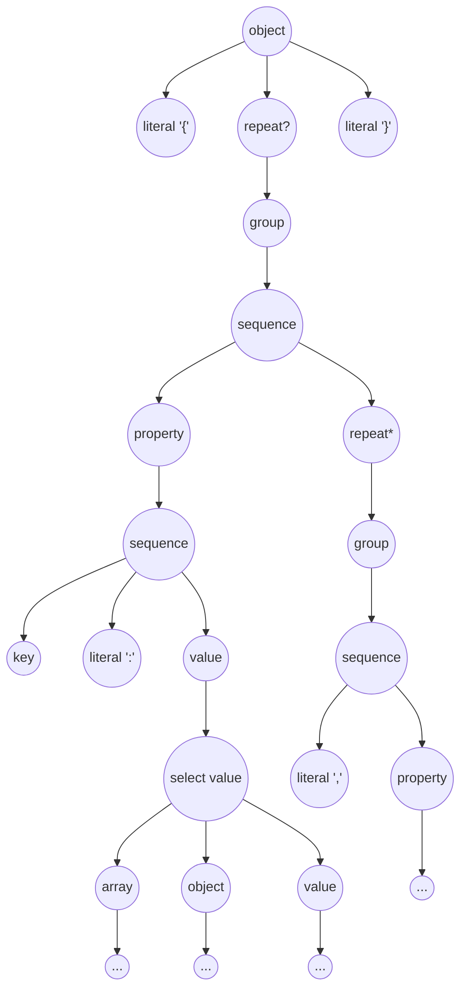
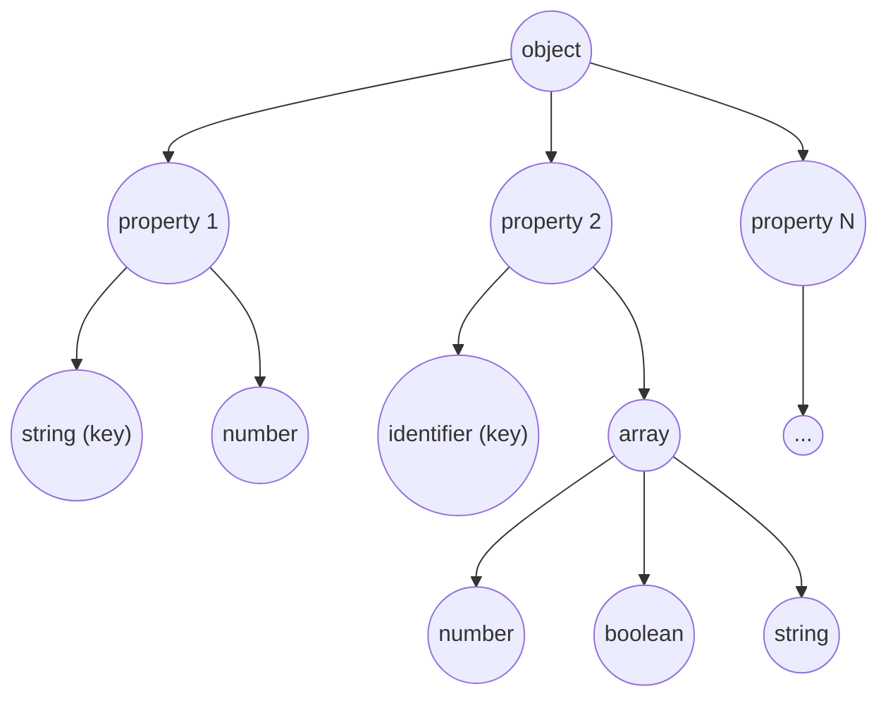

# 1 - Rules, Features, Examples and Otherwise

We'll demonstrate the core rules by example. Each example will be demonstrated starting with the definition using the interpreter script and a class equivalent (where it's not too tedious).

### Literal (`gg.ast.core.rules.LiteralRule.cs`)

A literal rule succeeds if the characters of the literal are matched in the text in the same order. In the interpreter script a literal is defined by [declaring it as a string](../c_sharp/gg.ast.examples/introduction/hello_world.spec), eg:

```csharp
helloWorld = "hello world";
```

The equivalent c# [code](../c_sharp/gg.ast.examples/introduction/HelloWorld.cs):

```csharp
public static IRule HelloWorldRule()
{
	return new LiteralRule()
	{
		Tag = "helloWorld",
		Characters = "hello world"
	};
}
```

Note that the code equivalent has the option to parse the characters with or without case sensitivity (see the property `bool IsCaseSensitive { get; set; } = true`). This option currently doesn't exist in the interpreter script.

To use the rule see the [corresponding test](../c_sharp/gg.ast.examples.test/introduction/HelloWorldTest.cs). We'll include this test here for this example but since the tests will generally the same, these will be omitted in further examples.

```csharp
[TestMethod]
public void HelloWorldRuleTest()
{
	// the spec file works the same
	var helloWorldRule = HelloWorld.HelloWorldRule();

	var helloWorldText = "hello world";
	var helloWorldResult = helloWorldRule.Parse(helloWorldText);
	
	Assert.IsTrue(helloWorldResult.IsSuccess);
	Assert.IsTrue(helloWorldResult.CharactersRead == helloWorldText.Length);
	Assert.IsTrue(helloWorldResult.Nodes[0].Tag == "helloWorld");

	var hiWorldText = "hi world";
	var hiWorldResult = helloWorldRule.Parse(hiWorldText);

	// "hi world" does not match "hello world" so this will fail
	Assert.IsFalse(hiWorldResult.IsSuccess);
	Assert.IsTrue(helloWorldResult.CharactersRead == 0;
	Assert.IsTrue(helloWorldResult.Nodes == null);
}
```

### Characters ([`gg.ast.core.rules.CharRule.cs`](../c_sharp/gg.ast/core/rules/CharRule.cs))

Where literals parse characters in a predefined sequence, the CharRule allows for parsing characters in any order as long as they are (not) part of a set. Sets of characters come in the following variations:

```csharp
// $ matches any character (as long as there are characters)
anyCharacter = $;

// matches characters between 'a' and 'z'
aToZSet = `az`;

// matches characters between 'a' and 'z', 'A' and 'Z' and '0' to '9'
wideSet = `azAZ09`;

// matches any character as long as it's a, b, c
abcEnumeration = 'abc';

// matches any character as long as it is NOT a, b, c
notABCEnumeration = !'abc';
```

The [corresponding test](../c_sharp/gg.ast.examples.test/introduction/CharSetsTest.cs) demonstrates how to use this rule and its variations.

Note that the class offers other properties such as Min/Max, this will be explained later in the RepeatRule. Futhermore there is currently no 'notInSet', this will be added in a later version.

### Sequence ([`gg.ast.core.rules.SequenceRule.cs`](../c_sharp/gg.ast/core/rules/SequenceRule.cs))

With the Literal and Character rules in place we can start building rule compositions. The 'Sequence' rule takes a number of other rules and matches these rules in sequence of appearance. 

Within the interpreter a sequence can come in two forms as shown below. The first form allows for 'whitespace' in between the rules, the second form does not. 

```csharp
// This sequence separates the rule values with a space, this implies tokens need to appear in the input text without spaces.
helloWorld         = helloToken worldToken;

// This sequence separates the rule values with a comma, allowing for whitespace to appear in between the tokens.
helloSpaciousWorld = helloToken, worldToken;

helloToken = "hello";
worldToken = "world";
```

In the code the only difference between these rules is that the `helloWorld` rule has a null value for the SequenceRule's `Whitespace` property whereas the `helloSpaciousWorld` rule defines a [`CharRule`](#characters-ggastcorerulescharrulecs) matching the characters in the set `' \t\r\n'`. ie:

```csharp
public static IRule HelloSpaciousWorldSequence()
{
	return new SequenceRule()
	{
		Tag = "helloSpaciousWorld",
		WhiteSpaceRule = new CharRule()
		{
			Characters = " \t\r\n",
			MatchCharacters = CharRule.MatchType.InEnumeration
		},
		Subrules = new IRule[]
		{
			new LiteralRule()
			{
				Tag = "hello",
				Characters = "hello"
			},
			new LiteralRule()
			{
				Tag = "world",
				Characters = "world"
			},
		}
	};
}
```

If you don't want to define the whitespace rule yourself every time you need one, the [ShortHandRules](../c_sharp/gg.ast/common/ShortHandRules.cs) class defines a convenient utility method to create a whitespace rule (`ShortHandRules.CreateWhitespaceRule`).

### Or ([`gg.ast.core.rules.OrRule.cs`](../c_sharp/gg.ast/core/rules/OrRule.cs))

The OrRule allows rule selection. Given a list of options separated by a '|', the first rule matching the current position in the text passes. Eg:

```csharp
// Example of an or rule.
helloOrWorld       = "hello" | "world";

// Order matters: wrongResult will try a value before an operation and stop. If the input
// is an operation it will always be tagged as a value. correctResult will try to parse
// an operation before a value and will correctly tag input as either an operation or a value.
# wrongResult        = value | operation;
# correctResult      = operation | value;

operation          = value, operator, value;
operator           = "+" | "-" | "/" | "*";
value        	   = `09`; 
```
More information on how to construct an OrRule can be found in the [test](../c_sharp/gg.ast.examples.test/introduction/OrTest.cs).

One thing to note in this example is the hash in front of the 'wrongResult' and 'correctResult'. This hash denotes 'visibility' of the `AstNodes` produced by the rule. This will be discussed elsewhere.

### Repeat ([`gg.ast.core.rules.RepeatRule.cs`](../c_sharp/gg.ast/core/rules/RepeatRule.cs))

The RepeatRule allows for repeating the same rule multiple times. There are several variations and shorthand forms. The shorthand forms have a single postfix, either '?', '*' or '+'. The 'explicit' repeat form requires a range to be specified as a postfix. If the range postfix uses square brackets ('[]') any whitespace in between the repeats is being ignored, if a smaller/greater than is being used ('<>') no whitespace is expected. If the lower bound or upper bound in the range is omitted, no lower or upper bound is expected. ie:

```csharp
// short hand forms, short hand does not parse whitespace
zeroOrOne               = helloWorld?;
zeroOrMore              = helloWorld*;
oneOrMore               = helloWorld+;

// explicit form repeats allowing for whitespace in between
explicitWs.zeroOrOne    = helloWorld[..1];
explicitWs.zeroOrMore   = helloWorld[];
explicitWs.oneOrMore    = helloWorld[1..];
explicitWs.oneOrTwo     = helloWorld[1..2];
explicitWs.two          = helloWorld[2];

// explicit form repeats with no whitespace in between
explicitNoWs.zeroOrOne  = helloWorld<..1>;
explicitNoWs.zeroOrMore = helloWorld<>;
explicitNoWs.oneOrMore  = helloWorld<1..>;
explicitNoWs.oneOrTwo   = helloWorld<1..2>;
explicitNoWs.two        = helloWorld < 2 >;
```
 
More information on how to use the `RepeatRule` can be found in the [repeatrule test](../c_sharp/gg.ast.examples.test/introduction/RepeatTest.cs).

### NotRule ([`gg.ast.core.rules.NotRule.cs`](../c_sharp/gg.ast/core/rules/NotRule.cs))

The not rule inverts the result of result of the associated subrule. Ie if the a literal rule would match the text "foo", a `NotRule` with that same literal rule would match anything but "foo". 

One major caveat is that the `NotRule` does not advance the cursor position. If the given subrule of a NotRule fails, then the NotRule succeeds but the parsing process does not move forward in the text. This means the NotRule can be used to test for certain conditions but it also implies one can easily get in an infinite loop. Eg:

```csharp
// This by itself will always succeed as long as not "foo" on the input. 
// Since the not rule will not move the cursor, this will be stuck in an infinite loop
// on any input except "foo"
infiniteLoop = !"foo"*;
```

Some rules have build in detection to spot infinite loops and will throw a `ParseException` when this is the case, but it's better to avoid an infinite loop altogether by for instance adding a rule reading any [follow up character](../c_sharp/gg.ast.examples/introduction/not.spec):

```csharp
commentEnd      = "*/";
notEndOfComment = !commentEnd $;
```

While the not rule using `!` has its use, there is an alternative which provides performance improvements and slightly better readability: the not&kip (`~`) operator. This operator does the same as not (`!`) but will move the cursor forward if the not rule succeeds. Eg:

```csharp
infiniteLoop        = !"foo"*;
avoidInfiniteLoop   = ~"foo"*;

skipUntilCommentEnd = ~commentEnd*;

altComment          = commentStart skipUntilCommentEnd commentEnd;
```
As always, check the [accompanying test](../c_sharp/gg.ast.examples.test/introduction/NotTest.cs) for more information.

### AST Visibility

Given a sufficiently complex rule set, the generated AST may get rather large. Some of these rules may serve little to no value to the information the AST provides. Take this [json example](../c_sharp/gg.ast.examples/specfiles/json.spec).

```csharp
using "types/types.spec";

document = array | object;

# jsonValue = typeValue | array | object;

property = key, ":", jsonValue;

# key = string | identifier;

identifier = (`azAZ` | "_") (`azAZ09` | "_")*;

array = "[", (jsonValue, (",", jsonValue)*)?, "]";
object = "{", (property, (",", property)*)?, "}";
```

The 'jsonValue' rule in this example selects from a typeValue, array or object. While this is useful, adding this node to the ast tree adds an unnecessary node. Generally speaking we're interested in the outcome of this selection, not in the selection itself. We can prevent this node from being added to the AST tree by prefixing it with `#`, leading to a smaller overall tree and less work to process. 

The action of keeping nodes out of the AST tree is referred to (in gg.ast) as defining the rule's visibility (see [IRule.Visibility](../c_sharp/gg.ast/core/IRule.cs)). There are three values 

* 'visible', the node is added to the AST
* 'transitive' (`#`), the node is removed, but its children are added to the AST
* 'hidden' (`##`), the node and its children are removed. 

Named rules are by default 'visible'. Unnamed rules, usually the parts that make up a rule, are by default set to 'transitive'.

Without culling certain nodes, a json property parsed with the rules above, could look like this:



With culling the resulting ast generated from the json spec above could looks like the graph below, quite a difference.



### Groups, Usings and Comments

Other elements which make up the spec files are:

* Comments, both single line comments `//` and multiline comments `/* comment */`
* Usings, you can include other spec files by simply referring to their file relative to the base directory eg: `using "types/types.spec";` (eg see the [json example](./c_sharp/gg.ast.examples/json/json.spec))
* Groupings, you can combine groups of operators and rules using `(` and `)` eg:

```csharp
identifier = (`azAZ` | "_") (`azAZ09` | "_")*;
```
