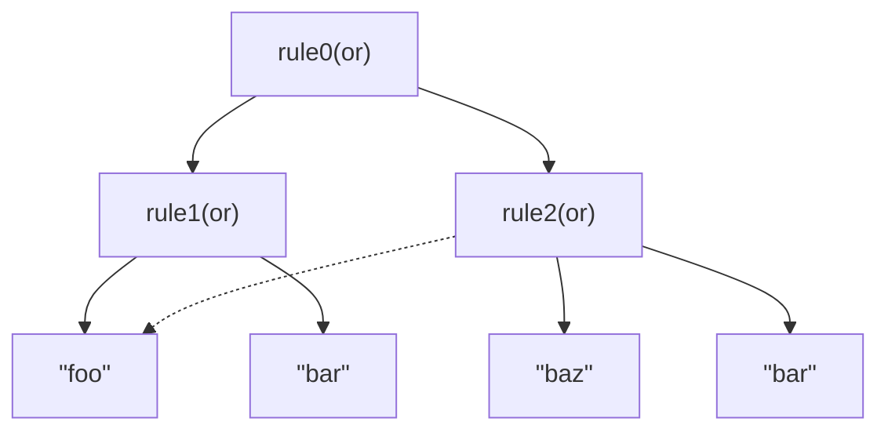
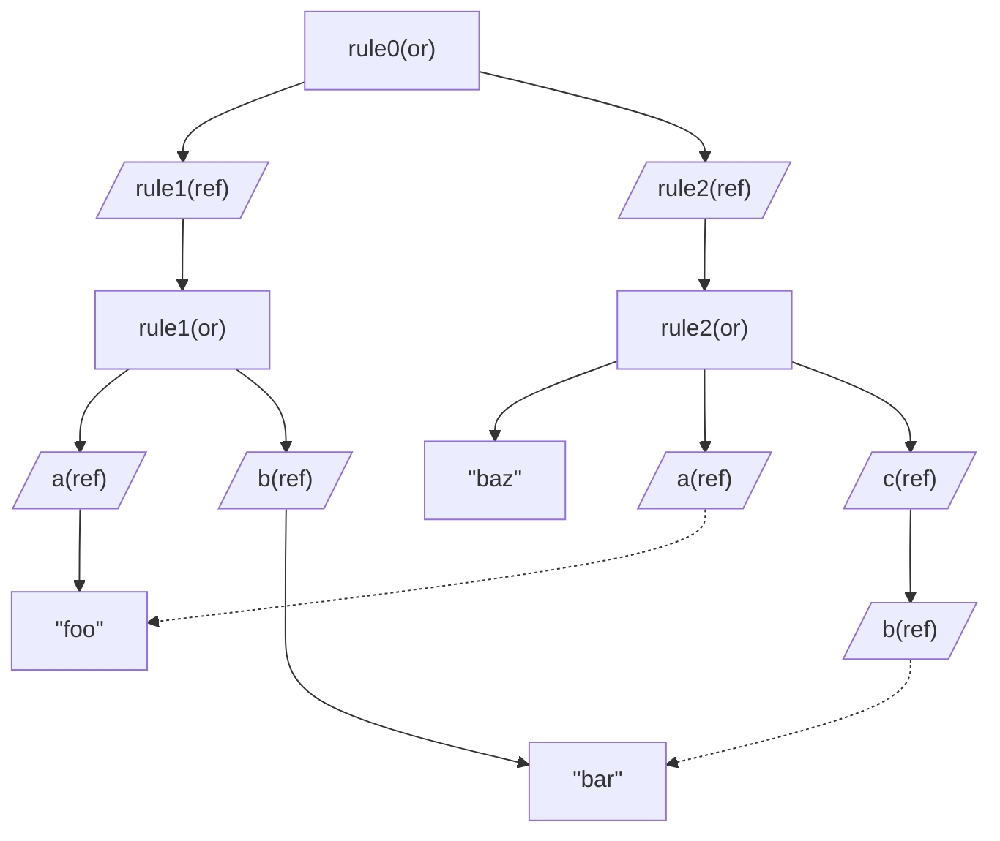
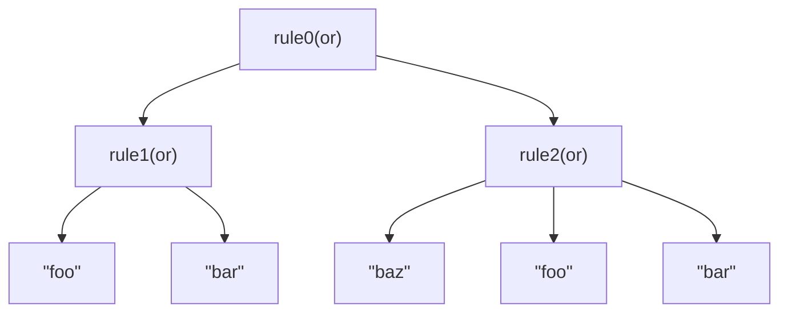
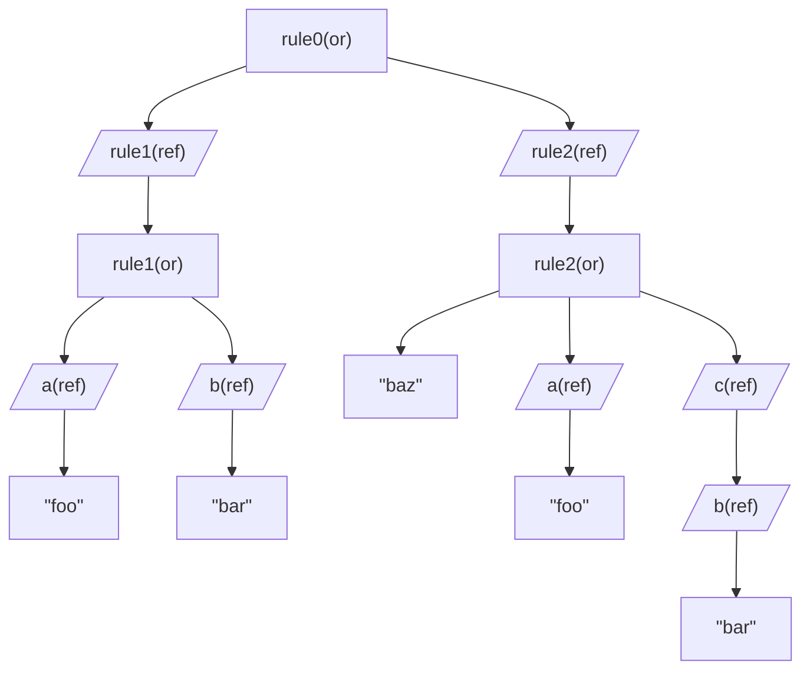

# Gast Tool

The `gast tool` ([gg.ast.tool](../c_sharp/gg.ast.tool/Program.cs)) is a command line tool to (eventually) run various AST related tasks. Currently it can only be used to export rules in spec files to a mermaid diagram.

The command line options for the gast tool are:

`gast.exe specfile -m|--mermaid mermaidOutputfile -o|--options rdm`

* `r`: show reference nodes. Having this option will add nodes produced by reference rules to the diagram.
* `d`: allow duplicates. Normally the graph will only show unique nodes and will create loops if rules  are referred to by different rules. However this may create somewhat confusing diagrams. With duplication these references are replicated.
* `m`: export the chart with `"```mermaid"` tags so it can be easily added to a .md file (like this one)

Take the spec following as an example:

```csharp
rule0 = rule1 | rule2;

rule1 = a | b;
a = "foo";
b = "bar";
c = b;

rule2 = "baz" | a | c;

```

With no options (`gast example.spec --mermaid example.md`) this results in (possibly best seen with a mermaid plugin):



With the show references, 'r', option (`gast example.spec --mermaid example.md -o r`) the flowchart will look this: 



With the 'd' option, allow duplicates (`gast example.spec --mermaid example.md -o d`) the flowchart will look this: 



With the 'rd' option, allow both references and duplicates (`gast example.spec --mermaid example.md -o rd`) the flowchart will look this: 




