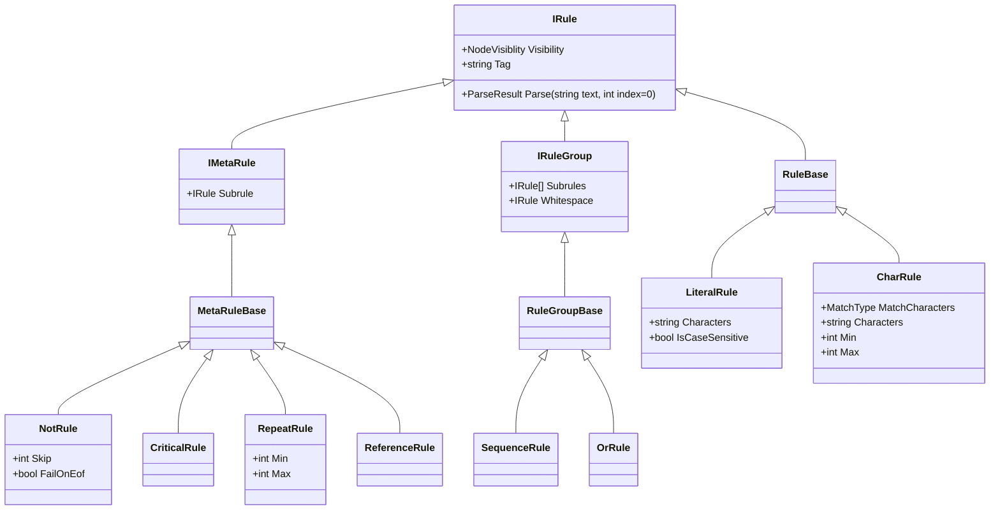

# 2 - Project setup

There are two main projects and two test projects:

* `gg.ast` contains the parser and interpreter.
  * `gg.ast.core` core classes 
  * `gg.ast.core.rules` basic core rule with which texts can be parsed
  * `gg.ast.interpreter` implements classes to define the parse and production rules to generate a lexer/parser from script.
  * `gg.ast.common` common rules e.g. rules to parse types.
  * `gg.ast.util` various utility classes
* `gg.ast.examples` contains the examples of how to use gg.ast

## Core classes

At the core (`gg.ast.core`) are the following notions:

* An `IRule` defines a node in the tree of rules used to transform a text into an AST tree. Its central method is ` ParseResult Parse(string text, int index = 0)`

* An `IMetaRule` is derived from IRule and defines a (single) `Subrule` that does most of the heavy lifting in terms of parsing.

* A `IRulegroup` is derived from IRule and defines a number of `Subrules` doing all the work. 

For all these interfaces there are corresponding abstract base classes (`RuleBase`, `RuleGroupBase` and `MetaRuleBase`).

Each of these methods produce a `ParseResult` a struct with the following properties:

* `bool IsSuccess`, did the rule succeed?
* `int CharactersRead`, (if successful) the number of characters read.
* `List<AstNode> Nodes`, if successful this may contain 0 or more AST nodes generated by the rule. 

Based on these concepts a number of all core rules are defined which can be used to parse texts. 

