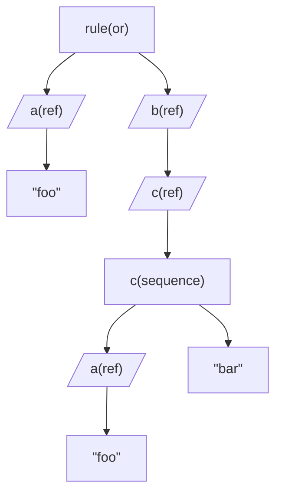
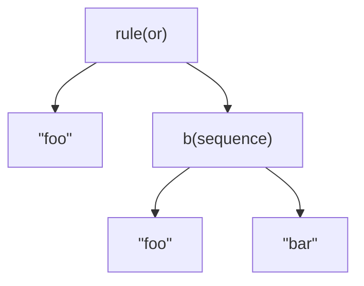

# Substitution and Inlining

When compiling a IRule graph there are various optimizations happening. The optimizations can be grouped in two types of operations. 

* `Inlining`: this process replaces `'reference rules'` ie, rules referring to other rules with their actual non-reference rule.
* `Substitution`: this process replaces groups of rules for single rules where possible. 

## Inlining 

let's say we have the following spec file:

```csharp
rule = a | b;
a = "foo";
b = c
c = a, "bar";
```

in `rule = a | b`, 'a' and 'b' are reference rules, referring to well ... a and b. The corresponding graph will look like this:




When parsing a text using this graph, the rule graph will have to go through the reference rules to find the eventual rules that actually test something. In order to avoid having to do all this redundant work, we can replace the references actual values. This will reduce the graph to this: 



Note that while the references are replaced, it is only their "content" which changes but the Tag stays the same. Eg when `b` in the example above is replaced with `c`, b's contents change from a `reference` to a `sequence` (ie the contents of `c`) but it keeps the tag 'b'. 

By keeping the tags, we can make aliases to other rules thus defining the "intended use" as expressed by its tag in context of the rest of the rule graph, but re-using the content of already defined rules. Eg in json a "string" can have the "intended use" of a "key" of a property but also the "value" of the same property.  

## Substitution

When applying _substitution_ to a rule graph we try to replace multiple nodes with a single node. In the current version there is only of case where this happens: the substitution of a "charRule" followed by a "repeatRule". The charRule has a "build-in" repeat, so instead of having an extra object specifying the min and max number of repeats, we can just fold that into the charRule itself.