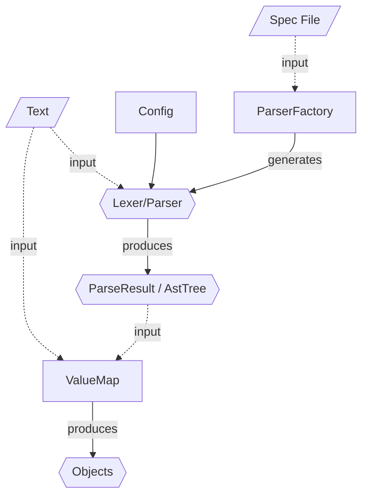


gg.ast v.0.2
============

gg.ast is a c# library defining a lexer/tokenizer, parser, parser factory and tooling. Additionally gg.ast offers a interpreter language to build lexers/parser on a high(er) level. 

gg.ast is still under development so expect bugs, missing features, inconsistent features but hopefully it can provide some use in its current state. At the bottom of this document is a backlog of bugs and future features. There is no nupackage available at the moment, in order to use this project simply (git) clone it and compile it locally.

gg.ast is released under the creative commons attribution 3.0 unported https://creativecommons.org/licenses/by/3.0/ 

## Elements making up gg.ast



At the core of gg.ast is the `parser/lexer`. This is a collection of object defining rules which given an input int the form of some `text` can produce a series of tokens in the form of a `ParseResult` and an `AstTree`. The nodes of this `AstTree` can be mapped to some application specific objects using a `ValueMap`. While you can program the Lexer/Parser from scratch using the `RuleObjects` in the gg.ast project, it's easier to generate the Lexer/Parser using a `ParserFactory` and a so called `Spec File`. 

A `Spec File` is a text file defining the rules similar to the [EBNF notation](https://en.wikipedia.org/wiki/Extended_Backus%E2%80%93Naur_form). While there are some key differences, if you are familiar with EBNF, the gg.ast spec file format should be easy to pick up. 

## Example

We'll demonstrate the use of gg.ast by means of a simple example. For more extensive examples see the [rules documentation](./doc/1_rules.md).

The example consists of thee parts:
* A spec file
* A short piece of code demonstrating how to generate a parser from the spec file
* A snippet of code outlining how to create objects from a parsed input file.

A spec file for a json document could look like the following:

```csharp
/*
 * Example of a minimal json specification.
 */
using "./specfiles/types.spec";

document = array | object;

# jsonValue = typeValue | array | object;

property = key, ":", jsonValue;

// using an identifier as key is not really according to standards... but it's practical
# key = string | identifier;

identifier = (`azAZ` | "_") (`azAZ09` | "_")*;

array = "[", (jsonValue, (",", jsonValue)*)?, "]";
object = "{", (property, (",", property)*)?, "}";
```

Using a `ParserFactory` and a this .spec file you can create a JsonParser, which can be used build to build an AST.

```csharp
var text = File.ReadAllText("./json.spec");
var json = new ParserFactory().Parse(text);

var donuts = File.ReadAllText("./json/donuts.json");
var donutsAst = json.Parse(donuts);
```

Once you have an AST a `ValueMap` can be used to map AST values to objects. In this example the AST is mapped to simple dictionaries of objects and arrays (see [the JsonRules class](./c_sharp/gg.ast.examples/json/JsonRules.cs) for a full example).

```csharp
// JsonRules.cs
public static ValueMap CreateValueMap(ValueMap map = null)
{
	// copy the value map from the basic types
	var jsonValueMap = map ?? TypeRules.CreateValueMap();

	// map an node with the tag 'array' to an Array object 
	jsonValueMap[Tags.Array] = (str, node) =>
	{
		var length = node.Children.Count;
		var result = new object[length];

		// map the node's children
		for (var i = 0; i < length; ++i)
		{
			var childTag = node.Children[i].GetTag();
			result[i] = jsonValueMap.Map(childTag, str, node.Children[i]);
		}

		return result;
	};

	// map other values
	...

	return jsonValueMap;
}

// Example.cs
var valueMap = JsonRules.CreateValueMap();
var donutsObj = valueMap.Map<Dictionary<string, object>>(text, r.Nodes[0]);
```

To learn more about gg.ast see:

* [The rules documentation](./doc/1_rules.md) for examples and the specifics of all core rules available.
* [gast tool documentation](./doc/2_gast.md) describes the 'gast' tool a CLI for gg.ast.
* [The project setup](./doc/3_project.md) for an outline of the organization of the code.
* [parser details, aliasing, substitution](./doc/4_substitution.md) explains how the ParseFactory optimizes a rule graph generated from a spec file by removing redundant nodes.

# Backlog
## v 0.3

* abort on failure (critical) = {"literal"};  {literal"[3]}
* Improve Error handling / reporting
* figure out a way to declare literals as case insensitive
* Optimize inlining by not revisiting reference rules that may have been inlined already

## Beyond v0.3

* Export interpreter spec to code
* Add commands such as:
	* .print("smt"), .print(rule "smt" line ":" column)
	* .call("function name")
	* .exit(123)
* Add regex rule
* Implement MD parsing example
* Functions and variables examples
* Calculator with variables and functions example
* YAML parser example
* HTML parser example
* Logic parser
* Logic parser with variable and functions
* Subset of c#
* c# Interpreter
* "Minimal version"
